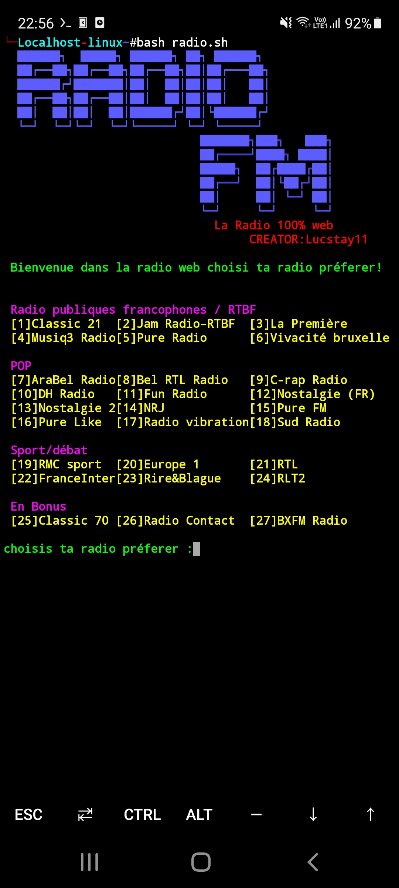
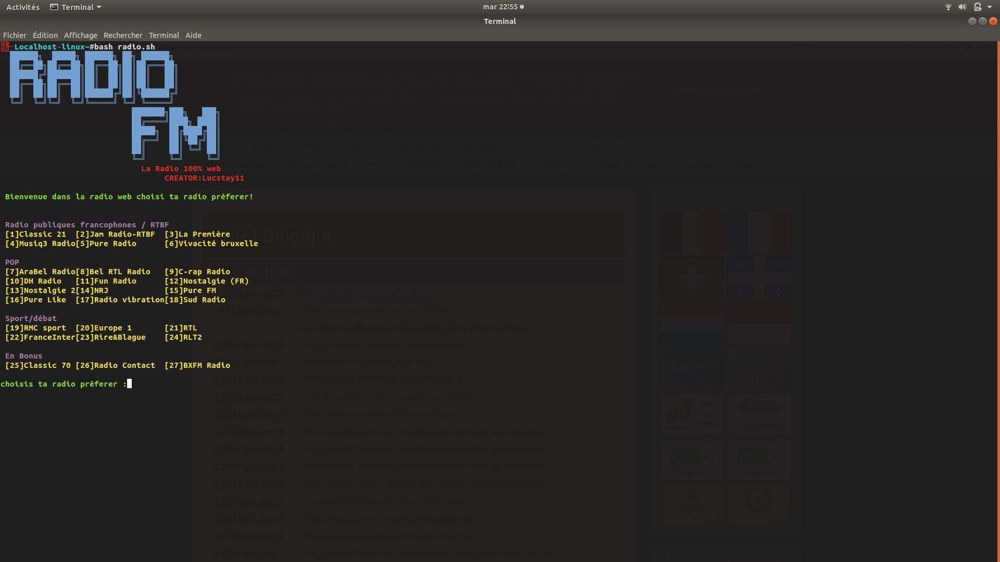

<h1 align="center">RADIO FM WEB for Linux and Termux 📻 </h1>
<p align="center"> <a href="https://developer.android.com" target="_blank" rel="noreferrer">  </a> <a href="https://www.linux.org/" target="_blank" rel="noreferrer"> </p>  
 
<p align="center">
  
  
  
 </p>

<p align="center">


</p>

<p>Bonjour à toutes et à tous donc comme vous l'avez remarqué la plupart des nouveaux telephones n'ont plus de port jack et de puce FM ce qu'il leur permettait d'écouter de la radio dans leur temps voulu! Cela dérange beaucoup de personne qui aimait bien écouter leur radio préferer donc c'est pour cela que j'ai créér une radio web avec plus de 27 stations radio connues(Française/Belge) pour vous faire kiffer comme au bon vieux temps!

Donc vous avez juste à lancer le script et puis choisir une radio et puis le son se fera entendre en arriere plan vous pouvez faire ce que vous voulez en même temps.</p> 

# Pour l'installation rien de bien compliqué!

 ```
 $ git clone https://github.com/Lucstay11/RADIO-FM-WEB-for-linux-or-termux
 $ cd RADIO-FM-WEB-for-linux-or-termux
 $ chmod +x radio.sh
 $ bash radio.sh
 ```
  
 # Les commandes pour le lecteur:
 ```
 - p = pause
 - m = mute
 - q = quitter
 ```
 
# LES PAQUETS=>

Pour Termux:
```
$ apt install mpv
```
Pour Linux:
```
$ Sudo apt install mpv 
```
Voila il y a juste un paquet à installer.

Donc n'hesiter pas à laisser des commentaires et profiter bien de cette radio internet!!

### Trouver moi sur :
<p align="left">
  <a href="https://github.com/Lucstay11" target="_blank"></a>
<a href="https://discord.gg/ZGfGVmaC" target="_blank">
</p>
